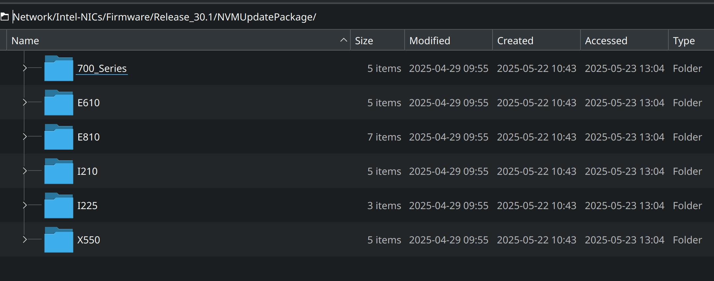

## Intel-NICs_Firmware-Update.md
This task is not difficult for experienced people, please be patient in this case. For all less experienced people… you will get the job done be reading attentional these instruction. 2025-05-30 state of the art.

### Note-s:
1. No firmware-file for "macOS" is included. In this case & in each case where a dedicated firmware doesn't exist or you have no access to OS, you can update the Firmware over an, for this cases/purposes prepared, USB-Stick.
2. Whit following linked instructions you can create an EFI-environment on a USB-stick: [Create-EFI-Bootable-USB-for-Firmware](https://github.com/Advantaged/Create-EFI-Bootable-USB-for-Firmware).
3. Nevertheless, you can use this instructions for prepare/extract the necessary binary file & follow these same instruction to execute the firmware-update.
4. No all Linux-package-manager are handled in these instructions, user having a different package-manager, should at least be able to install the below-mentioned packages over the CLI &| GUI-app-s.

### Affected/Concerned Intel NICs




### Prerequisite

The commands `unzip`, `wget`, `cd`, and `tar -xvf` are generally available and work similarly across most UNIX-like operating systems, including BSD, Linux, and macOS. Here’s a brief overview of each command and its availability:

1. `cd` (Change Directory)
* **Availability:** Built into the shell (e.g., bash, sh, zsh) and works on all UNIX-like systems.
* **Usage:** Changes the current directory.
* **Example:** `cd /path/to/directory`
2. `wget` (Web Get)
* **Availability:** Usually pre-installed on most Linux distributions and can be installed on macOS and BSD systems.
* **Usage:** Downloads files from the web.
* **Example:** `wget http://example.com/file.zip`
* **Installation:**
    * **macOS:** `brew install wget`
    * **BSD:** `pkg install wget`
3. `unzip` (Unzip)
* **Availability:** Often pre-installed on many Linux distributions and can be installed on macOS and BSD systems.
* **Usage:** Extracts files from a ZIP archive.
* **Example:** `unzip file.zip`
* **Installation:**
    * **macOS:** `brew install unzip`
    * **BSD:** `pkg install unzip`
4. `tar -xvf` (Tape Archive)
* **Availability:** Pre-installed on all UNIX-like systems.
* **Usage:** Extracts files from a tar archive.
* **Example:** `tar -xvf file.tar.gz`
* **Options:**
    * `-x`: Extract files from the archive.
    * `-v`: Verbosely list the files processed.
    * `-f`: Specifies the archive file to use.
**Example Workflow**
Here’s a simple example workflow that uses all these commands:

1. Change Directory:

```
cd /path/to/working/directory
```
2. Download a File:
```
wget http://example.com/archive.tar.gz
```
3. Extract the Tar Archive:
```
tar -xvf archive.tar.gz
```
4. Extract a ZIP Archive (if needed):
```
unzip file.zip
```
These commands should work seamlessly across most UNIX-like operating systems, with the possible need to install `wget` and `unzip` on systems where they are not pre-installed.

### Step-by-Step Guide

#### 1. Download the Firmware Package:

* Use the provided `wget` command to download the firmware package:

 ```
 wget https://downloadmirror.intel.com/853744/Release_30.1.zip
```

#### 2. Extract the Downloaded Package:

* Extract the zip file:

```
unzip Release_30.1.zip
```

#### 3. Navigate to the NVM Update Package Directory:

* Change to the directory containing the NVM update package:

```
cd Release_30.1/NVMUpdatePackage/700_Series/
```

#### 4.Extract the NVM Update Package for Linux:

* Extract the tar.gz file for Linux:

```
tar -xvf 700Series_NVMUpdatePackage_v9_54_Linux.tar.gz
```

#### 5.Navigate to the Linux x64 Directory:

* Change to the directory containing the NVM update tool:

```
cd 700Series/Linux_x64
```

#### 6.List all installed NICs:

* The NVM Update Tool is usually a script named `nvmupdate64e`. Run it to list the available NICs:

```
sudo ./nvmupdate64e -l NICs-List.txt
```
* This command will generate a list of the available NICs in the `NICs-List.txt` file.

#### 7. Inspect the NICs List:

* Open the NICs-List.txt file to inspect the details of your NICs:

```
cat NICs-List.txt
```

#### 8. Backup the Current Firmware:

* Use the `nvmupdate64e` tool to back up the current firmware for each NIC. The backup files will be saved in the current directory.

```
sudo ./nvmupdate64e -b 01:00.0
sudo ./nvmupdate64e -b 02:00.0
sudo ./nvmupdate64e -b 03:00.0
```

#### 9. Right file to flash:

1. `*710*T4L*9p54*retail*.bin`

```
X710_T4L_9p54_CFGID14p0_Retail_K37380.bin
X710_T4L_9p54_CFGID14p0_Retail_K58564.bin
```
2. `*710*T2L*9p54*retail*.bin`

```
X710_T2L_9p54_CFGID14p3_Retail_K37379.bin
X710_T2L_9p54_CFGID14p3_Retail_K58515.bin
```

3. `*710*DA2*9p54*retail*.bin`

```
X710DA2_9p54_CFGID7p2_J51959_Retail_8M
X710DA2OCP_9p54_CFGID7p2_RETAIL.bin
```

#### 10. Search for files in the CLI of BSD, Linux, and macOS

To search for files with specific patterns in their names across different UNIX-like operating systems (including BSD, Linux, and macOS), you can use the `find` command. The `find` command is widely available and behaves similarly across these systems. Here are the commands for each of your search patterns:

1. Search nº one:

```
find /path/to/search -type f -name '*710*T4L*9p54*retail*.bin'
```

2. Search nº two:

```
find /path/to/search -type f -name '*710*T2L*9p54*retail*.bin'
```

3. Search nº three:

```
find /path/to/search -type f -name '*710*DA2*9p54*retail*.bin'
```

* **Explanation:**
    * `/path/to/search`: Replace this with the directory where you want to start the search.
    * `-type f`: This option ensures that only files (not directories) are matched.
    * `-name 'pattern'`: This option specifies the pattern to match filenames. The `*` character is a wildcard that matches any sequence of characters.
* **Example:**
If you want to search in the current directory and all subdirectories, you can use `.` as the path:
```
find . -type f -name '*710*T4L*9p54*retail*.bin'
find . -type f -name '*710*T2L*9p54*retail*.bin'
find . -type f -name '*710*DA2*9p54*retail*.bin'
```
These commands will search for files with the specified patterns in their names, starting from the current directory and including all subdirectories.

#### 11. Update the Firmware

1. T4L (X710-T4L) NIC:

* Choose the "retail" version with the highest build number (e.g., `K58564` is higher than `K37380`).

```
sudo ./nvmupdate64e -u 03:00.0 -f X710_T4L_9p54_CFGID14p0_Retail_K58564.bin
```

2. T2L (X710-T2L) NIC:
* Choose the retail version with the highest build number (e.g., `K58515` is higher than `K37379`).

```
sudo ./nvmupdate64e -u 01:00.0 -f X710_T2L_9p54_CFGID14p3_Retail_K58515.bin
```

3. DA2 (X710-DA2) NIC:

* Choose the retail version with the highest build number (e.g., `J51959` is a specific build number, but both should work).

```
sudo ./nvmupdate64e -u 02:00.0 -f X710DA2_9p54_CFGID7p2_J51959_Retail_8M.bin
```

### Attention/Note: Restart your computer now❗️

### Good luck 👍

